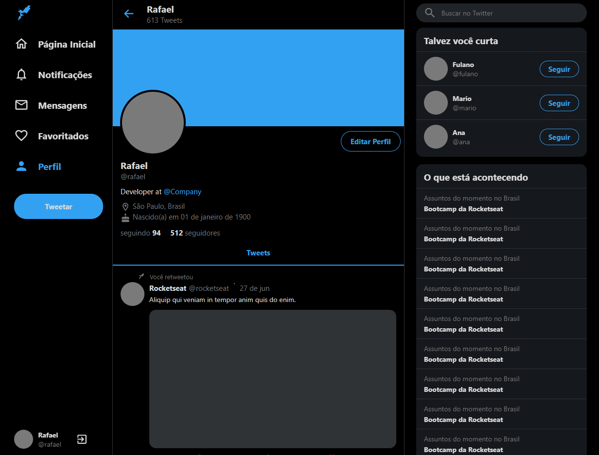

<h1 align="center">
  
   
  Twitter Clone
</h1>

<h3 align="center">
<strong>Project based on <a href="https://www.youtube.com/watch?v=K-8z_4xvT3o&t=7358s" target="_blank">Rocketseat video </a></strong>
</h3>

  
  
  
  
   
   
  <a href="#space_invader-technologies">Technologies</a>
   
   
  
   
   
  

## :space_invader: Technologies

- [ReactJS](https://pt-br.reactjs.org/)
- Typescript
- [styled components](https://styled-components.com/)
- Styled Icons
- [React Sticky Box](https://www.npmjs.com/package/react-sticky-box)
